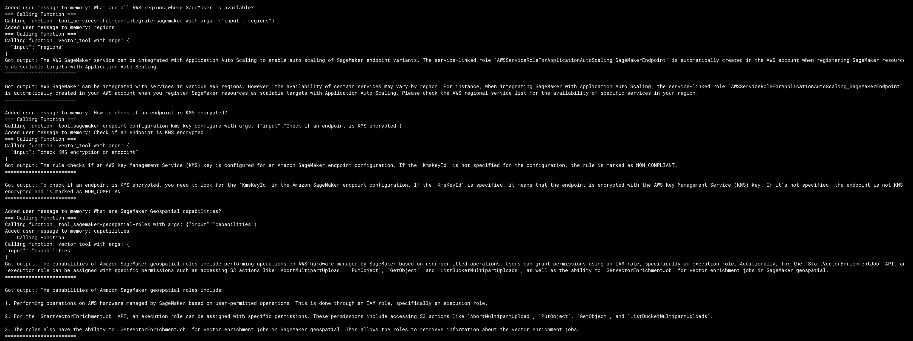

# DocuAid: A POC for AWS Documentation Navigation System

## Overview

### Scenario
Company X has a significant amount of documentation that their developers must navigate. Developers often spend too much time searching for information or asking coworkers simple questions already covered in the documentation. This situation disrupts experienced developers and can lead to the dissemination of outdated information.

To address this, Company X needs to create a tool aimed at reducing the time developers spend searching through documentation. The Proof of Concept (POC) focuses on a subset of their data, primarily using AWS documentation, and is designed to assist developers with unfamiliar parts of the documentation, minimizing the need for coworker interruptions. The POC is targeted at one of the development teams.

### Goals
The main goals of this POC are:
- To demonstrate that the system can significantly reduce the time developers spend searching for documentation.
- To create a system that provides up-to-date, accurate information, reducing the dependency on other team members.
- To test the feasibility of pointing users to further reading and relevant documents.

### Example Questions
The POC should be able to handle the following example questions using AWS documentation:
- What is SageMaker?
- What are all AWS regions where SageMaker is available?
- How to check if an endpoint is KMS encrypted?
- What are SageMaker Geospatial capabilities?

## Installation

### Prerequisites
- Python 3.12 and an environment with access to GPU
- uv (An extremely fast Python package and project manager, written in Rust)
- A valid OpenAI API Key

### Steps
1. **Clone the repository**:
    ```bash
    git clone https://github.com/santiagocorrea/docu-aid.git
    cd your-repo
    ```
2. **Install uv and python with the official standalone instaler**:
    ```bash
    curl -LsSf https://astral.sh/uv/install.sh | sh 
    source $HOME/.cargo/env zsh 
    uv python install 3.12
    ```

2. **Create and activate a virtual environment**:
    ```bash
    uv venv # this will create a .venv directory with the installed python distribution
    ```

3. **Install dependencies from the pyproject.toml file**:
    ```bash
    uv sync
    ```

4. **Run the system**:
    ```bash
    uv run streamlit run src/docu_aid/app.py
    ```

5. **Access the application**:
    Open your browser and go to `http://localhost:8501`

## System Design

### Architecture
This POC uses an Agentic RAG (Retrieval Augmented Generation) approach based on Multi-Document Agent. This approach allow us to answer different types of questions across the AWS documentations such as QA comparing different docs, Summaries over a specific doc, and comparing summaries between different docs by setting up a "document agent" over each Document (each doc agent can do QA/summarization within its doc) and setup a top-level agent over this set of document agents to orchestrate and syntethize the outputs from the document agents. The architecture is inspired in the [MetaGPT](https://arxiv.org/pdf/2308.00352) paper and the multi-agent module from LlamaIndex. The figure below illustrates the architecture diagram:


The system is designed with the following core components:

1. **Document Ingestion**:
   - Currently ingests public AWS documentation.
   - Future expansion planned to include internal, sensitive documentation.
   - Utilizes the open-source embedding model `dunzhang/stella_en_400M_v5` with 1024 dimensions.
   - For each document:
     - Creates a VectorIndex for efficient semantic search.
     - Generates a SummaryIndex to enable quick summarization.

2. **Question Processing**:
   - Analyzes user questions to determine intent and identify relevant information.
   - For each document:
     - Establishes a QueryEngine for both VectorIndex and SummaryIndex.
     - Converts QueryEngines into QueryTools, accessible by document-specific agents.
   - Document agents (powered by OpenAI GPT-3.5 Turbo):
     - Decide whether to perform summarization or semantic search for their respective documents.
     - This approach optimizes the number of indices accessed by the top-level agent.

3. **Response Generation**:
   - Employs a top-level agent (powered by OpenAI GPT-4) which:
     - First identifies and retrieves the relevant document agents as tools (from the ObjectIndex) based on the user's query.
     - Passes the input exclusively to these selected document agents.
     - Synthesizes a comprehensive response by integrating outputs from the activated document agents.

4. **System Workflow**:
   - User submits a question.
   - Top-level agent analyzes the question and selects relevant document agents.
   - Selected document agents process the query using their specialized indices.
   - Document agents return processed information to the top-level agent.
   - Top-level agent compiles and refines the information into a coherent response.
   - System presents the final answer to the user.

5. **Key Advantages**:
   - Modular design allows for easy scaling and integration of new document sources.
   - Efficient use of computational resources by selective activation of relevant document agents.
   - Combines the broad knowledge of GPT-4 with the specific, up-to-date information from ingested documents.
   - Flexible architecture capable of handling both general queries and specific, documentation-based questions.

6. **Security Considerations**: While the POC uses public documentation, the final MVP system will include mechanisms to ensure sensitive internal documentation is handled according to proprietary and geographical restrictions.

### Technology Stack

- **Backend**: 
  - Python

- **Frontend**: 
  - Streamlit

- **Data Processing, Indexing, and Storage**:
  - LlamaIndex
    - For document processing and indexing
    - For creating and managing VectorIndex and SummaryIndex
    - For persisting vector data using `vector_index.storage_context.persist`

- **Embedding Model**:
  - `dunzhang/stella_en_400M_v5` (1024 dimensions)

- **Search & Retrieval**: 
  - LlamaIndex
    - For query processing
    - For semantic search using VectorIndex
    - For summarization using SummaryIndex

- **Natural Language Processing and Generation**: 
  - OpenAI GPT-3.5 Turbo (for document-specific agents)
  - OpenAI GPT-4 (for top-level agent, intent understanding, and response synthesis)

- **Query Engine and Tool Creation**:
  - LlamaIndex
    - For creating QueryEngines from indices
    - For converting QueryEngines to QueryTools for agent use

## Reproducibility

### Dataset
The POC uses publicly available AWS documentation. The dataset can be updated or extended as needed to include more documentation or internal company-specific data.

### Steps to Reproduce
1. **Document Ingestion**:
   - You can add more documents to the `data/` directory. When the POC is executed (`uv run streamlit run src/docu_aid/app.py`), the knowledge base (vector store) is recreated if the document doesn't exist otherwise it uses the persisted version at `vector_index`.

2. **Testing**:
   - The following screenshots shows the execution of the POC using the example outputs:
   
   
   
   
   
   
   
   
   The following fillustrates the logs from the agents during the execution of the agentic RAG:
   
   - Additional test cases can be added to cover more documentation scenarios.

3. **Deployment**:
   - The POC can be deployed locally or on a server using Docker for consistent environments. Please refer to the prerequisites section. 
   - Security settings will need to be adjusted when handling sensitive internal documentation.


## Future Work
- **Expand Dataset**: Integrate internal, sensitive documentation with proper access controls.
- **Enhance NLP Models**: Improve question understanding and response accuracy.
- **Further Reading Recommendations**: Implement and refine the feature to suggest relevant documentation based on user queries.
- **Performance Optimization**: Scale the system to handle larger datasets and more concurrent users.


## Contact
For questions or support, please contact Santiago Correa at [santiago.correa.cardona@gmail.com].

